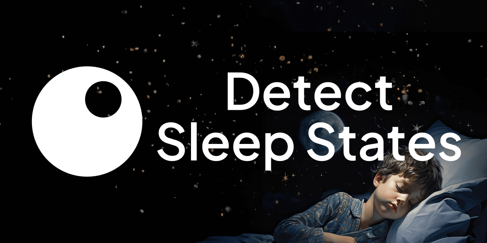

[](https://teamepoch.ai/competitions/hmvvlonh9mia8hcqdainarv8s4qoe3)

[](https://teamepoch.ai/)
[![Kaggle Badge](https://img.shields.io/badge/-Detect_Sleep_States-20beff.svg?logo=data:image/svg+xml;base64,PD94bWwgdmVyc2lvbj0iMS4wIiBlbmNvZGluZz0iVVRGLTgiIHN0YW5kYWxvbmU9Im5vIj8+CjxzdmcKICAgd2lkdGg9IjY0IgogICBoZWlnaHQ9IjY0IgogICB2aWV3Qm94PSIwIDAgMzIgMzIiCiAgIHZlcnNpb249IjEuMSIKICAgaWQ9InN2ZzEiCiAgIHhtbG5zOnhsaW5rPSJodHRwOi8vd3d3LnczLm9yZy8xOTk5L3hsaW5rIgogICB4bWxucz0iaHR0cDovL3d3dy53My5vcmcvMjAwMC9zdmciCiAgIHhtbG5zOnN2Zz0iaHR0cDovL3d3dy53My5vcmcvMjAwMC9zdmciPgogIDxkZWZzCiAgICAgaWQ9ImRlZnMxIj4KICAgIDxjbGlwUGF0aAogICAgICAgaWQ9IkEiPgogICAgICA8dXNlCiAgICAgICAgIHhsaW5rOmhyZWY9IiNCIgogICAgICAgICBpZD0idXNlMSIgLz4KICAgIDwvY2xpcFBhdGg+CiAgICA8cGF0aAogICAgICAgaWQ9IkIiCiAgICAgICBkPSJNMzEuNSAxNS45NzhoMjg5djEzMC4wNDRoLTI4OXoiIC8+CiAgPC9kZWZzPgogIDxwYXRoCiAgICAgdHJhbnNmb3JtPSJtYXRyaXgoLjUyNzAyNyAwIDAgLjUyNzAyNyAtMzAuNjMyMjg4IC0yMi40NTU1OSkiCiAgICAgY2xpcC1wYXRoPSJ1cmwoI0EpIgogICAgIGQ9Ik0xMDUuNzUgMTAyLjk2OGMtLjA2LjIzOC0uMjk4LjM1Ny0uNzEzLjM1N0g5Ny4xYy0uNDc3IDAtLjg5LS4yMDgtMS4yNDgtLjYyNUw4Mi43NDYgODYuMDI4bC0zLjY1NSAzLjQ3N3YxMi45M2MwIC41OTUtLjI5OC44OTItLjg5Mi44OTJoLTYuMTUyYy0uNTk1IDAtLjg5Mi0uMjk3LS44OTItLjg5MlY0My41YzAtLjU5My4yOTctLjg5Ljg5Mi0uODlINzguMmMuNTk0IDAgLjg5Mi4yOTguODkyLjg5djM2LjI4OGwxNS42OTItMTUuODdjLjQxNi0uNDE1LjgzMi0uNjI0IDEuMjQ4LS42MjRoOC4yMDRjLjM1NiAwIC41OTMuMTUuNzEzLjQ0NS4xMi4zNTcuMDkuNjI0LS4wOS44MDNMODguMjc0IDgwLjU4OGwxNy4yOTcgMjEuNDg4Yy4yMzcuMjM4LjI5Ny41MzUuMTguODkyIgogICAgIGZpbGw9IiMyMGJlZmYiCiAgICAgaWQ9InBhdGgxIgogICAgIHN0eWxlPSJmaWxsOiNmZmZmZmYiIC8+Cjwvc3ZnPgo=)](https://www.kaggle.com/competitions/child-mind-institute-detect-sleep-states/)
[![Python Version](https://img.shields.io/badge/Python-3.10-4584b6.svg?logo=data:image/svg+xml;base64,PHN2ZyB4bWxucz0iaHR0cDovL3d3dy53My5vcmcvMjAwMC9zdmciIHdpZHRoPSI2NCIgaGVpZ2h0PSI2NCIgdmlld0JveD0iMCAwIDMyIDMyIj48ZGVmcz48bGluZWFyR3JhZGllbnQgaWQ9IkEiIHgxPSI4MTEuNTI3IiB5MT0iNTc0Ljg5NSIgeDI9IjY2NS4yNTUiIHkyPSI1NzMuNzMyIiBncmFkaWVudFVuaXRzPSJ1c2VyU3BhY2VPblVzZSI+PHN0b3Agb2Zmc2V0PSIwIiBzdG9wLWNvbG9yPSIjMzY2YTk2Ii8+PHN0b3Agb2Zmc2V0PSIxIiBzdG9wLWNvbG9yPSIjMzY3OWIwIi8+PC9saW5lYXJHcmFkaWVudD48bGluZWFyR3JhZGllbnQgaWQ9IkIiIHgxPSI4NjIuODI0IiB5MT0iNjQyLjE3NiIgeDI9IjU3My4yNzYiIHkyPSI2NDIuMTc2IiBncmFkaWVudFVuaXRzPSJ1c2VyU3BhY2VPblVzZSI+PHN0b3Agb2Zmc2V0PSIwIiBzdG9wLWNvbG9yPSIjZmZjODM2Ii8+PHN0b3Agb2Zmc2V0PSIxIiBzdG9wLWNvbG9yPSIjZmZlODczIi8+PC9saW5lYXJHcmFkaWVudD48L2RlZnM+PGcgdHJhbnNmb3JtPSJtYXRyaXgoLjE2MTcgMCAwIC4xNTgwODkgLTEwNy41Mzc2NCAtODEuNjYxODcpIj48cGF0aCBkPSJNNzE2LjI1NSA1NDQuNDg3YzAtMTMuNjIzIDMuNjUzLTIxLjAzNCAyMy44MjItMjQuNTYzIDEzLjY5My0yLjQgMzEuMjUtMi43IDQ3LjYyNyAwIDEyLjkzNSAyLjEzNSAyMy44MjIgMTEuNzcgMjMuODIyIDI0LjU2M3Y0NC45NDVjMCAxMy4xODItMTAuNTcgMjMuOTgtMjMuODIyIDIzLjk4aC00Ny42MjdjLTE2LjE2NCAwLTI5Ljc4NyAxMy43ODItMjkuNzg3IDI5LjM2M3YyMS41NjRoLTE2LjM3NmMtMTMuODUyIDAtMjEuOTE3LTkuOTg4LTI1LjMwNS0yMy45NjQtNC41Ny0xOC43NzYtNC4zNzYtMjkuOTYzIDAtNDcuOTQ1IDMuNzk0LTE1LjY4NyAxNS45MTctMjMuOTY0IDI5Ljc3LTIzLjk2NGg2NS41MnYtNmgtNDcuNjQ1di0xNy45OHoiIGZpbGw9InVybCgjQSkiLz48cGF0aCBkPSJNODExLjUyNyA2ODguMzJjMCAxMy42MjMtMTEuODIzIDIwLjUyMy0yMy44MjIgMjMuOTY0LTE4LjA1MiA1LjE4OC0zMi41NCA0LjM5NC00Ny42MjcgMC0xMi42LTMuNjctMjMuODIyLTExLjE3LTIzLjgyMi0yMy45NjR2LTQ0Ljk0NWMwLTEyLjkzNSAxMC43ODItMjMuOTggMjMuODIyLTIzLjk4aDQ3LjYyN2MxNS44NjQgMCAyOS43ODctMTMuNzEgMjkuNzg3LTI5Ljk2M3YtMjAuOTY0aDE3Ljg1OGMxMy44NyAwIDIwLjQgMTAuMzA1IDIzLjgyMiAyMy45NjQgNC43NjQgMTguOTcgNC45NzYgMzMuMTU3IDAgNDcuOTQ1LTQuODE3IDE0LjM2NC05Ljk3IDIzLjk2NC0yMy44MjIgMjMuOTY0SDc2My45djZoNDcuNjI3djE3Ljk4eiIgZmlsbD0idXJsKCNCKSIvPjxwYXRoIGQ9Ik03MjguMTY2IDU0MS41MDVjMC00Ljk3NiAzLjk4OC05IDguOTMtOSA0LjkyMyAwIDguOTMgNC4wMjMgOC45MyA5IDAgNC45Ni00LjAwNiA4Ljk4Mi04LjkzIDguOTgyLTQuOTQgMC04LjkzLTQuMDIzLTguOTMtOC45ODJ6bTUzLjU5IDE0OS43OThjMC00Ljk2IDQuMDA2LTguOTgyIDguOTMtOC45ODIgNC45NCAwIDguOTMgNC4wMjMgOC45MyA4Ljk4MiAwIDQuOTc2LTMuOTg4IDktOC45MyA5LTQuOTIzIDAtOC45My00LjAyMy04LjkzLTl6IiBmaWxsPSIjZmZmIi8+PC9nPjwvc3ZnPg==)](https://www.python.org/downloads/)

# CMI - Detect Sleep States | Place 23/1877  
## This repository contains the code for our solution to [Child Mind Institute - Detect Sleep States](https://www.kaggle.com/competitions/child-mind-institute-detect-sleep-states) competition where we placed 23 out of 1877 teams. 

### Running main
Main should be run with the current working directory set to the directory main.


### Config
The config.json file is used to set the paths of data folders, where to read the raw data and where to save our processed data, to enable or disbale logging to weights and biasses and using ensembles or doing hyperparameter optimization and cross validation. Below is an exampleconfig we used.

```JSON
{
    "name": "config",
    "is_kaggle": false,
    "log_to_wandb": true,
    "pred_with_cpu": false,
    "train_series_path": "data/raw/train_series.parquet",
    "train_events_path": "data/raw/train_events.csv",
    "test_series_path": "data/raw/test_series.parquet",
    "fe_loc_in": "data/processed",
    "processed_loc_out": "data/processed",
    "processed_loc_in": "data/raw",
    "model_store_loc": "tm",
    "model_config_loc": "model_configs",
    "ensemble": {
        "models": ["spectrogram-cnn-gru.json"],
        "weights": [1],
        "comb_method": "confidence_average",
        "pred_only": false
    },
    "cv": {
        "splitter": "group_k_fold",
        "scoring": ["score_full", "score_clean"],
        "splitter_params": {
            "n_splits": 5
        }
    },
    "train_for_submission": false,
    "scoring": true,
    "visualize_preds": {
        "n": 0,
        "browser_plot": false,
        "save": true
    }
}
```
### Logging and Kaggle
To log our experminet results we use weights and biasses. However since logging when running inference on kaggle does not make sense we have the is_kaggle and log_to_wandb as optional arguments in the config. For being able to run on kaggle in cpu notebook and to be able to use our GPUs locally we also have the pred with cpu argumnet in the config (using torch.device() would also use the cpu on kaggle if the GPU is disabled for the notebook so this is redundant but used).

### Model training
For training models set the config to ensemble and for models give a list of all model configs you would like to use and their weights. By giving multiple model configs which are located in the model_config_loc (specified in the config) folder and weigths, you can make ensembles and give each model a different weight for the confidence averaging step.

To do cross validation replace see the example config below

```JSON
{
    "name": "config",
    "is_kaggle": false,
    "log_to_wandb": true,
    "pred_with_cpu": false,
    "train_series_path": "data/raw/train_series.parquet",
    "train_events_path": "data/raw/train_events.csv",
    "test_series_path": "data/raw/test_series.parquet",
    "fe_loc_in": "data/processed",
    "processed_loc_out": "data/processed",
    "processed_loc_in": "data/raw",
    "model_store_loc": "tm",
    "model_config_loc": "model_configs",
    "hpo": "spectrogram-cnn-gru.json",
    "cv": {
        "splitter": "group_k_fold",
        "scoring": ["score_full", "score_clean"],
        "splitter_params": {
            "n_splits": 5
        }
    },
    "train_for_submission": false,
    "scoring": true,
    "visualize_preds": {
        "n": 0,
        "browser_plot": false,
        "save": true
    }
}
```

When the config is this way cross validation will be done using the parameters given with cv. The splitter, number of folds and what scores to calculate are all arguments (clean score refers to your score on data without NaNs). This config is also used when doing hpo with weights and biasses.

When train for submission is set to true the model will also be trained on the complete train set. The visualize preds arguments are used to generate plots using plotly or to simply save jpeg of our models predictions for each series compared to the real events.

To see how the preprocessing and feature engineering steps are chosen along with how hyperparameters for each model are set please refer to src/configs/readme.md and the individual model configs in the model_configs folder. Each model config lists all preprocessing, feature engineering steps along with model hyperparameters and the type of model in the formats defined in src/configs/readme.md. (There might be some methods that re not mentioned in the readme)

The training happens by passing all our data to the trainer class located in src/models/trainers.

### Model architectures
In our code the model classes (classes that have methods like train and pred) and model architectures are separated. To see our model architectures please refer to src/models/architectures and to see the model classes please refer to src/models.

## Contributors

This repository was created by [Team Epoch IV](https://teamepoch.ai/team#iv), based in the [Dream Hall](https://www.tudelft.nl/ddream) of the [Delft University of Technology](https://www.tudelft.nl/).

Read more about this competition [here](https://teamepoch.ai/competitions/hmvvlonh9mia8hcqdainarv8s4qoe3).

[](https://github.com/EWitting)
[](https://github.com/Jeffrey-Lim)
[](https://github.com/hjdeheer)
[](https://github.com/schobbejak)
[](https://github.com/tolgakopar)
